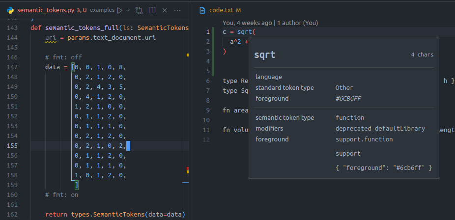

.. _howto-semantic-tokens:

How To Interpret Semantic Tokens
================================

.. seealso::

   :ref:`Example Server <example-semantic-tokens>`
      An example implementation of semantic tokens

   :lsp:`textDocument/semanticTokens`
      Semantic tokens in the LSP Specification

Semantic Tokens can be thought of as "Syntax Highlighting++".

Traditional syntax highlighting is usually implemented as a large collection of :mod:`regular expressions <python:re>` and can use the language's grammar rules to tell the difference between say a string, variable or function.

However, regular expressions are not powerful enough to tell if

- a variable is read-only
- a given function is deprecated
- a class is part of the language's standard library

This is where the *Semantic* part of Semantic Tokens comes in.

How are tokens represented?
---------------------------

Unlike most parts of the Language Server Protocol, semantic tokens are not represented by a structured object with nicely named fields.
Instead each token is represented by a sequence of 5 integers::

   [0, 2, 1, 0, 3,  0, 4, 2, 1, 0, ...]
    ^-----------^   ^-----------^
      1st token       2nd token    etc.

In order to explain their meaning, it's probably best to work with an example.
Let's consider the following code snippet::

   c = sqrt(
     a^2 + b^2
   )

Token Position
--------------

The first three numbers are dedicated to encoding a token's posisition in the document.

The first 2 integers encode the line and character offsets of the token, while the third encodes its length.
The trick however, is that these offsets are **relative to the position of start of the previous token**.

*Hover over each of the tokens below to see how their offsets are computed*

.. raw:: html
   :file: tokens/positions.html

Some additional notes

- For the ``c`` token, there was no previous token so its position is calculated relative to ``(0, 0)``
- For the tokens ``a`` and ``)``, moving to a new line resets the column offset, so it's calculated relative to ``0``

Token Types
-----------

The 4th number represents the token's type.
A type indicates if a given token represents a string, variable, function etc.

When a server declares it supports semantic tokens (as part of the :lsp:`initialize` request) it must send the client a :class:`~lsprotocol.types.SemanticTokensLegend` which includes a list of token types that the server will use.

.. tip::

   See :lsp:`semanticTokenTypes` in the specification for a list of all predefiend types.

To encode a token's type, the 4th number should be set to the index of the corresponding type in the :attr:`SemanticTokensLegend.token_types <lsprotocol.types.SemanticTokensLegend.token_types>` list sent to the client.

*Hover over each of the tokens below to see their corresponding type*

.. raw:: html
   :file: ./tokens/types.html

Token Modifiers
---------------

So far, we have only managed to re-create traditional syntax highlighting.
It's only with the 5th and final number for the token do we get to the semantic part of semantic tokens.

Tokens can have zero or more modifiers applied to them that provide additional context for a token, such as marking is as deprecated or read-only.
As with the token types above, a server must include a list of modifiers it is going to use as part of its :class:`~lsprotocol.types.SemanticTokensLegend`.

.. tip::

   See :lsp:`semanticTokenModifiers` in the specification for a list of all predefiend modifiers.

However, since we can provide more than one modifier and we only have one number to do it with, the encoding cannot be as simple as the list index of the modifer(s) we wish to apply.

To quote the specification:

.. pull-quote::

   Since a token type can have n modifiers, multiple token modifiers can be set by using bit flags, so a tokenModifier value of 3 is first viewed as binary ``0b00000011``, which means ``[tokenModifiers[0], tokenModifiers[1]]`` because bits ``0`` and ``1`` are set.

*Hover over each of the tokens below to see how their modifiers are computed*

.. raw:: html
   :file: ./tokens/modifiers.html

Finally! We have managed to construct the values we need to apply semantic tokens to the snippet of code we considered at the start

   Our semantic tokens example implemented in VSCode
